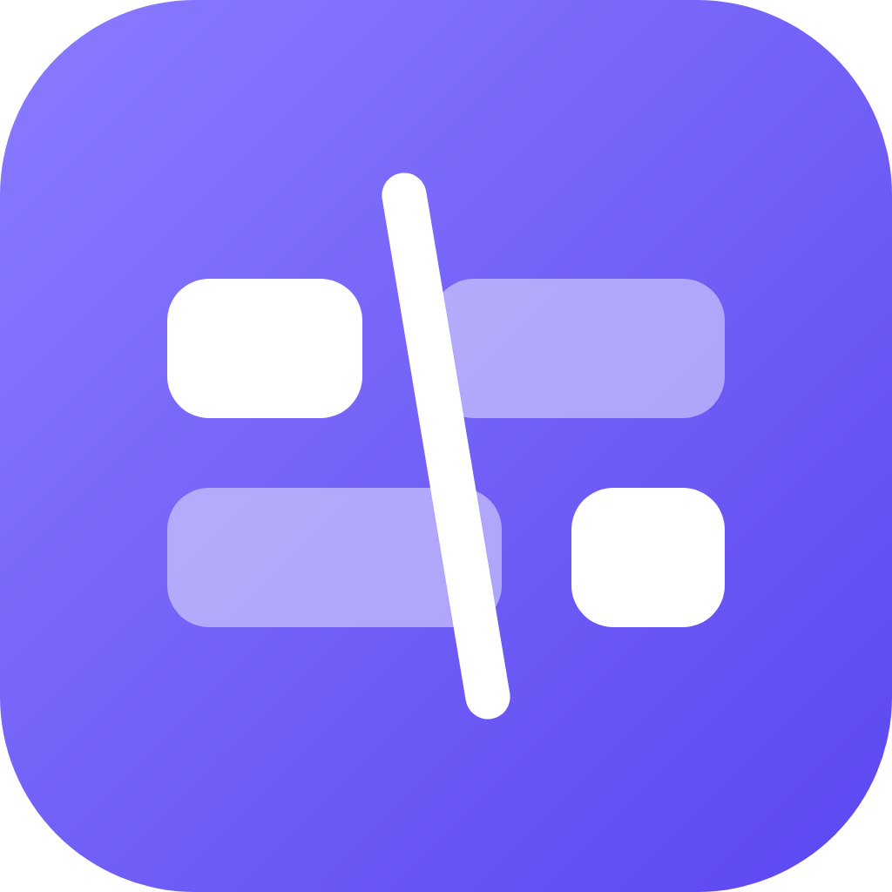
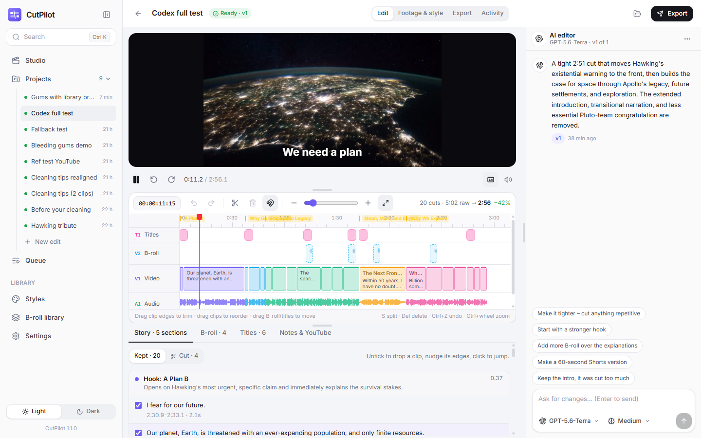
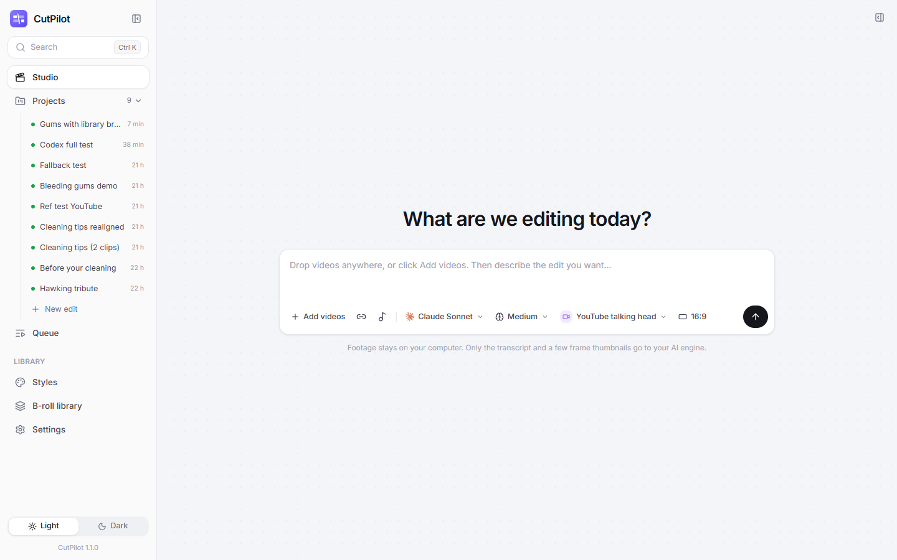
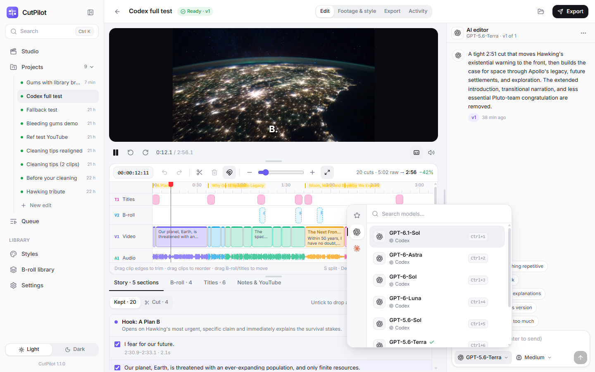
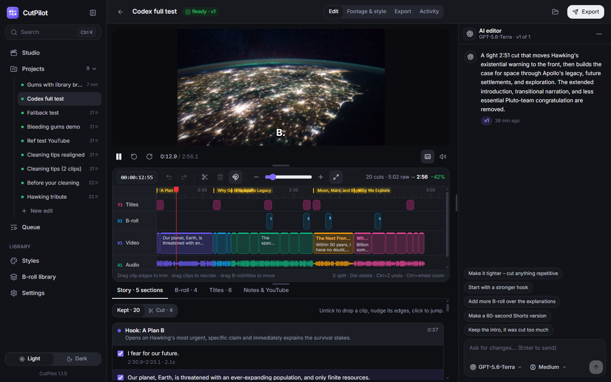
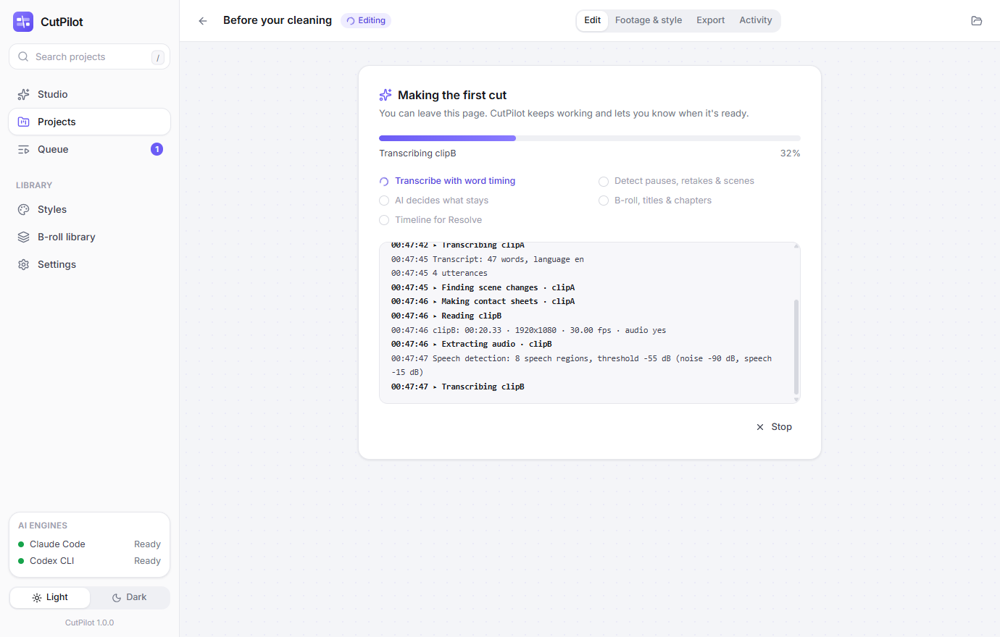

<p align="center"></p>

<h1 align="center">CutPilot</h1>

<p align="center"><b>The AI writes the edit. You review it.</b><br>
A Windows desktop app that edits talking-head, vlog and YouTube footage with the Claude Code or Codex subscription you already have, then hands a finished timeline to DaVinci Resolve.</p>

<p align="center"><a href="https://github.com/Mr-Dark-debug/cutpilot/releases/latest"><b>Download for Windows</b></a></p>



## Why

An edit is just a list of decisions: which parts to keep, where B-roll goes, which titles show when. You don't need an NLE open to make those decisions, so CutPilot makes them **outside** the editor, on disk:

1. It transcribes your footage with word timing and finds every pause from the waveform.
2. Your AI engine reads the transcript (and a few frame thumbnails) and decides what stays: retakes, stumbles, "sorry let me start again", dead air and filler go; a hook, B-roll, titles and chapters are planned.
3. CutPilot turns that plan into a frame-accurate timeline for **DaVinci Resolve** (FCPXML), captions (SRT), YouTube title/description/tags, and optionally a finished MP4.

Because nothing runs inside an NLE, **you can edit many videos in parallel** and only review.

## Features

- **Uses your own Claude Code or Codex sign-in.** No API keys and no extra AI bill. CutPilot runs the official CLIs headlessly and never touches your credentials. If one engine runs out of usage, it can switch to the other.
- **Clean cuts.** Cut points come from the audio waveform, not the transcript, so words are never clipped. The AI picks whole utterances by id, so it can't invent timestamps.
- **Instant review.** The player plays the edit live, skipping removed parts and overlaying B-roll, titles and captions, with no render needed.
- **A real timeline.** Titles, B-roll, video and audio-waveform tracks with timecode, zoom (Ctrl+wheel), snapping, ripple trims by dragging clip edges, drag-to-reorder, split at playhead (S), delete, and undo/redo. Restore anything the AI cut from the Cut list.
- **Chat with the AI editor.** "Start with the question", "tighter", "make a 60-second Short". Pick the model and reasoning effort in the chat, watch what the AI is doing (thinking, looking at frames, writing decisions), and switch between versions from the ⋯ menu.
- **B-roll** from your own library (AI-described) or Pexels/Pixabay with your free API key. Empty slots become Resolve markers.
- **Styles and references.** 15 detailed styles: YouTube talking head, vlog, travel, tutorial, educational explainer, podcast/interview, Shorts/Reels/TikTok, product review, gaming, cooking, fitness, course/webinar, documentary, reaction and promo. Edit their house rules or make your own. Add reference videos or YouTube links, and CutPilot measures their pacing and the AI writes matching rules.
- **Fast to drive.** Ctrl+K Spotlight search for projects, styles, clips, settings and actions; collapsible sidebar (Ctrl+B) with projects listed like chats; resizable editor, timeline and chat panels.
- **Batch.** Drop 15 videos and get 15 edits. Transcription and AI work have separate concurrency limits.
- **DaVinci Resolve hand-off.** Resolve is found wherever it's installed (Start-menu shortcut, registry, or a path you choose). One click exports and opens Resolve; *Workspace ▸ Scripts ▸ CutPilot Import* brings in media, timeline (cuts, B-roll on V2, titles, markers, chapters) and captions. Works with the free version.
- **Render MP4** in 16:9 or 9:16 with B-roll, titles, burned-in captions, a ducked music bed and −14 LUFS loudness, using NVENC when available.
- **Auto-updates** from GitHub Releases (signed).

| Studio | Model picker |
|---|---|
|  |  |
| **Dark theme** | **Working** |
|  |  |

## Install

1. Download `CutPilot_x.y.z_x64-setup.exe` from [Releases](https://github.com/Mr-Dark-debug/cutpilot/releases/latest) and run it. No admin rights needed. Windows SmartScreen may warn because the installer isn't code-signed: choose *More info ▸ Run anyway*.
2. On first start, CutPilot checks your setup:
   - **Tools:** FFmpeg, whisper.cpp and a Whisper model (~350 MB, one click). Optional: yt-dlp for YouTube references, the NVIDIA build of whisper.cpp for faster transcription.
   - **AI engine:** [Claude Code](https://docs.anthropic.com/en/docs/claude-code) and/or [Codex CLI](https://github.com/openai/codex). CutPilot can install them and opens a terminal for you to sign in.
3. Optional: install [DaVinci Resolve](https://www.blackmagicdesign.com/products/davinciresolve) (free) and add Pexels/Pixabay keys in *Settings ▸ B-roll sources*.

## Using it

1. **Studio:** drop videos, pick a model, reasoning effort and style, and say how you want it edited ("8-minute cut, hook with the best moment, B-roll on each tip").
2. **Review:** play the edit, trim or rearrange on the timeline, check the *Cut* list, or ask for changes in the chat.
3. **Export:** *Send to Resolve* to finish (grade, effects, deliver), or *Render MP4* directly. YouTube details and captions are ready to upload.

**Tip:** tune a style's house rules over the first few videos until the first cut is nearly right, then batch the rest.

## Privacy

Your footage never leaves your computer. Your AI engine receives the transcript, timing, a few small frame thumbnails (can be turned off) and your brief. Stock searches send only the search words to Pexels/Pixabay.

## Limits

- Cuts happen between utterances (phrases separated by pauses). A sentence spoken in one breath can't be split in the middle; nudge the clip edges by hand if needed.
- Free DaVinci Resolve can't be scripted from outside, so the final import is one menu click (*Workspace ▸ Scripts ▸ CutPilot Import*).
- Resolve ignores most transitions and effects on FCPXML import, so CutPilot sends cuts, B-roll, titles, markers and chapters, and you do grading and effects in Resolve.
- AI-generated B-roll isn't offered on purpose: generated footage of people, products and real places is often wrong in ways that hurt credibility.
- Windows only for now.

## Development

Requirements: Node 22+, Rust (stable), and FFmpeg/whisper.cpp (installed from the app or with `cutpilot-cli install …`).

```bash
npm install
npm run tauri dev
```

The whole pipeline also runs headlessly:

```bash
cd src-tauri && cargo run --bin cutpilot-cli -- new path/to/video.mp4 --style talking-head --engine claude --brief "Tight cut with chapters"
```

Other commands: `status`, `install <tool>`, `run <project-id>`, `revise <project-id> "<request>"`, `render <project-id> [--preview] [--vertical] [--captions]`, `export <project-id>`, `library <folder>`, `list`.

Tests: `cd src-tauri && cargo test --lib`. Design notes: [docs/PLAN.md](docs/PLAN.md).

### Releasing

```bash
node scripts/bump.mjs 1.2.3
```

Add a `## 1.2.3` section to `CHANGELOG.md`, commit, then `git tag v1.2.3 && git push --tags`. GitHub Actions builds the signed installer and publishes the release plus `latest.json`, and installed apps offer the update.

## License

MIT
